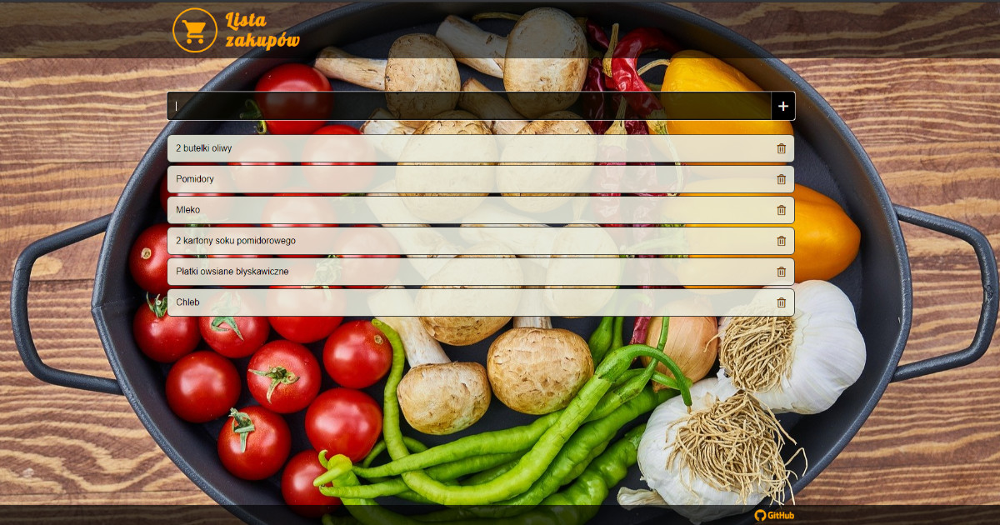

# Lista zakupów

Prosta lista zakupów, napisana w czystym HTML, CSS i JavaScript (bez użycia zewnętrznych frameworków i bibliotek). Użytkownik aplikacji może przeglądać listę, a także dodawać i usuwać poszczególne produkty. Dane przechowywane są w localStorage.

[Moje Zakupy na GitHub Pages](https://akulewicz.github.io/shoppinglist/)